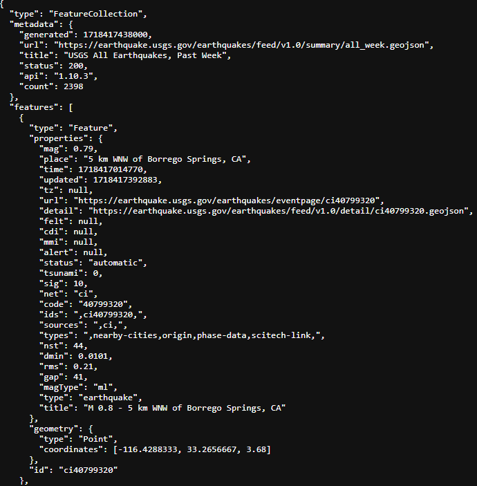
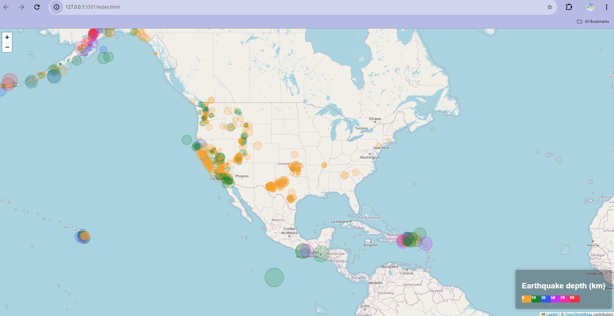
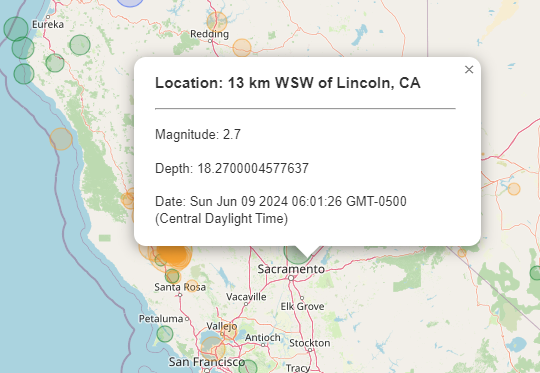

# leaflet-challenge
## Module 15 Challenge

This module challenge was completed using skills learned in Module 15 with Leaflet. Earthquake data was retrieved from the USGS website in a JSON format and used in the logic.js file to create a map showing earthquakes recorded in the last seven days and properties such as location, magnitude, depth, and date/time. The most challenging part of the assignment was creating the circle markers and formatting them to correctly display by magnitudeand depth, I relied heavily on module 15 activities and Xpert Learning Assistant to troubleshoot errors and fix the Java Script code to display everything correctly. The colors for the markers were found using imagecolorpicker.com. The legend was also tricky to format and I needed help from Xpert Learning Assistant to get it right. In the style.css file, I stylized the legend using code from 15-2 activity 4 and tweaked small elements to customize the legend to my map.

Below are screenshots of:
1. JSON information sample;
2. Earthquake map on the webpage;
3. Popup example.

## Resources
- Xpert Learning Assistant
- Module 15 Activities
- Earthquake data: https://earthquake.usgs.gov/earthquakes/feed/v1.0/summary/all_week.geojson
- Colors: https://imagecolorpicker.com/
- Leaflet documentation: https://leafletjs.com/reference.html
